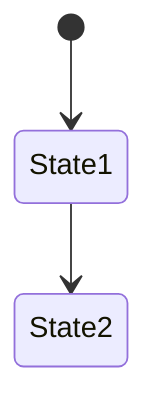
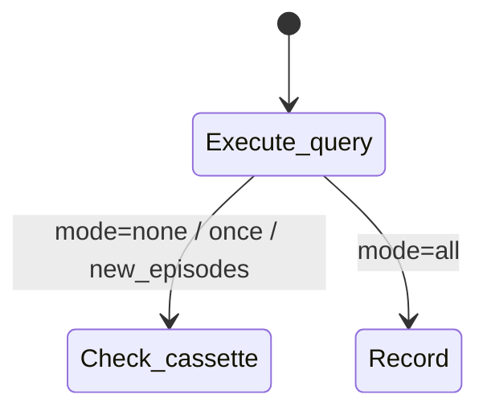

# Phase 3: Update docs with pool clone support - Research

**Researched:** 2026-03-08
**Domain:** Documentation (MkDocs Material, Diataxis framework)
**Confidence:** HIGH

## Summary

This phase adds four documentation artifacts covering the `adbc_clone()` / connection pooling support added in Phase 2. No code changes are involved -- the work is entirely new Markdown pages and minor edits to existing pages, following the established Diataxis structure (how-to / reference / explanation) already in use across the project's docs.

The existing documentation set provides strong, consistent patterns to follow. Every how-to guide uses Material for MkDocs tabbed code blocks for pyproject.toml / pytest.ini configuration, reference pages use `**Interface:**` blocks and tables, explanation articles use the "why, not how" style with mermaid diagrams where helpful. The project uses literate-nav and section-index plugins but navigation is actually defined directly in `mkdocs.yml` under the `nav:` key (no SUMMARY.md files found). Mermaid fenced code blocks are already configured via `pymdownx.superfences` with a custom fence definition.

The adbc-poolhouse library (the primary consumer motivating this feature) is a sibling project at `../adbc-poolhouse/`. Its real API uses `create_pool(config)` returning a `sqlalchemy.pool.QueuePool`, `pool.connect()` for checkout (which calls `source.adbc_clone()` internally), and `close_pool(pool)` or the `managed_pool()` context manager for cleanup. Code examples should use this real API.

**Primary recommendation:** Create four deliverables in order: (1) how-to guide, (2) reference page, (3) explanation article, (4) update existing pages (fixtures.md, index pages, mkdocs.yml nav). Follow existing patterns exactly -- the project's documentation style is well-established and consistent.

<user_constraints>
## User Constraints (from CONTEXT.md)

### Locked Decisions
- New how-to guide: "Use with connection pools" in `docs/src/how-to/`
- New dedicated reference page: "Connection Pooling" in `docs/src/reference/` covering adbc_clone() behaviour, shared cassette semantics, wipe state, limitations
- Add `adbc_clone()` to existing `fixtures.md` alongside the other fixtures
- New explanation article: "Connection pooling and replay" in `docs/src/explanation/`
- All pages nest under existing nav sections -- no nav restructuring
- Update `mkdocs.yml` nav entries for new pages
- How-to: practical focus, link to explanation for internals, no shared wipe state or `__new__` bypass details
- Reference: full adbc_clone() method behaviour, shared cassette semantics, clone-of-clone mention, limitations section with sequential-access constraint
- Explanation: design rationale, full pool replay lifecycle walkthrough, concurrent-access failure mode, wipe state sharing in 'all' mode
- Primary code example pattern: conftest fixture with pool (realistic project setup)
- Show both auto-patch and explicit `wrap()` approaches with pools
- Use real adbc-poolhouse API (import adbc_poolhouse, show create_pool() + pool.connect() + close_pool())
- Generic note that any pool library calling adbc_clone() works
- No separate CI section -- link to existing ci-without-credentials.md
- MkDocs Material warning admonition box in the how-to guide for limitations
- Concurrent access limitation framed as "not a problem in typical single-threaded test code"
- Explanation article covers concurrent-access failure mode in detail (replay queues are per-cursor, interleaved execute() calls could match results to wrong queries)

### Claude's Discretion
- Exact admonition wording and placement within pages
- How much of the explanation lifecycle to diagram vs prose
- Whether to use mermaid diagrams for the lifecycle
- Cross-linking between the four new/updated pages

### Deferred Ideas (OUT OF SCOPE)
- Phase 1's `cassette_differentiator_keys` feature documentation -- separate docs phase needed
- Foundry driver documentation (how to use with `adbc_driver_manager.dbapi`) -- separate docs phase
</user_constraints>

## Standard Stack

### Core
| Tool | Version | Purpose | Why Standard |
|------|---------|---------|--------------|
| MkDocs Material | (current, configured in project) | Documentation site generator | Already in use; all existing docs use this |
| pymdownx.superfences | (bundled with Material) | Mermaid diagram rendering | Already configured with custom fence in mkdocs.yml |
| pymdownx.tabbed | (bundled with Material) | Tabbed code blocks (pyproject.toml / pytest.ini) | Used in every how-to guide and the tutorial |
| admonition extension | (bundled with Material) | Warning/note/tip boxes | Used throughout existing docs |

### Supporting
| Tool | Purpose | When to Use |
|------|---------|-------------|
| pymdownx.snippets | Include external files | Not needed for this phase |
| mkdocstrings | Auto-generate API docs from docstrings | Not needed -- adbc_clone() docs are hand-crafted reference |

## Architecture Patterns

### Documentation File Placement
```
docs/src/
├── how-to/
│   ├── index.md                    # ADD link to pool guide
│   ├── connection-pools.md         # NEW
│   └── ...existing guides...
├── reference/
│   ├── index.md                    # ADD link to pool reference
│   ├── fixtures.md                 # EDIT: add adbc_clone() section
│   ├── connection-pooling.md       # NEW
│   └── ...existing refs...
├── explanation/
│   ├── index.md                    # ADD link to pool explanation
│   ├── connection-pooling.md       # NEW
│   └── ...existing explanations...
└── mkdocs.yml                      # EDIT: add nav entries
```

### Pattern 1: How-To Guide Structure
**What:** Task-oriented guide showing how to accomplish one specific goal.
**When to use:** For the "Use with connection pools" guide.
**Example:**
```markdown
# Use with connection pools

[1-2 sentence intro explaining what the guide achieves]

## [First task step]

=== "pyproject.toml"

    ```toml
    [tool.pytest.ini_options]
    adbc_auto_patch = ["adbc_driver_snowflake.dbapi"]
    ```

=== "pytest.ini"

    ```ini
    [pytest]
    adbc_auto_patch = adbc_driver_snowflake.dbapi
    ```

[Prose explaining what this does]

## [Next step with code example]

```python
# conftest.py
```

!!! warning
    [Limitation note]

## Related

- [Link 1](path) -- description
- [Link 2](path) -- description
```
Source: Pattern extracted from `docs/src/how-to/multiple-drivers.md`, `docs/src/how-to/scrub-sensitive-values.md`

### Pattern 2: Reference Page Structure
**What:** Lookup-oriented specification of a feature's exact behaviour.
**When to use:** For the "Connection Pooling" reference page and the fixtures.md addition.
**Example:**
```markdown
# [Feature Name]

[1 sentence describing what this page covers]

---

## `method_name()`

**Scope:** [scope]
**Type:** [type signature]

[Description of what the method does]

**Interface:**

```text
method_name(args) -> ReturnType
```

**Usage:**

```python
# Code example
```

---
```
Source: Pattern extracted from `docs/src/reference/fixtures.md`

### Pattern 3: Explanation Article Structure
**What:** Understanding-oriented article explaining "why" decisions were made.
**When to use:** For the "Connection pooling and replay" explanation.
**Example:**
```markdown
# [Topic]

This article explains [what and why].

## Why [design choice]

[Paragraphs explaining rationale]

## [Concept walkthrough]

[Prose or mermaid diagram showing lifecycle/flow]



## What this means for [user concern]

[Practical implications]

See [Reference page](../reference/page.md) for exact values.
```
Source: Pattern extracted from `docs/src/explanation/record-mode-semantics.md`, `docs/src/explanation/cassette-format-rationale.md`

### Pattern 4: Nav Entry Addition (mkdocs.yml)
**What:** Adding new pages to the existing navigation without restructuring.
**Example:**
```yaml
nav:
  - How-To Guides: how-to/
  - Reference:
      - Overview: reference/index.md
      - Connection Pooling: reference/connection-pooling.md  # NEW
      - Fixtures: reference/fixtures.md
      # ...existing entries...
  - Explanation: explanation/
```

Note: The `how-to/` and `explanation/` entries use directory-based nav (literate-nav plugin resolves these). The `reference/` section lists pages explicitly. New how-to and explanation pages need to be added to their respective `index.md` files to appear. The reference section needs an explicit nav entry in `mkdocs.yml`.

### Anti-Patterns to Avoid
- **Writing implementation details in how-to guides:** The how-to should not explain `__new__` bypass or shared wipe state internals. Link to the explanation article for that.
- **Duplicating content across pages:** Each page type serves a different purpose. Cross-link rather than repeat.
- **Breaking existing page structure:** Add sections to fixtures.md using the same format as existing fixture entries (separator, heading, scope/type block, interface, usage example).

## Don't Hand-Roll

| Problem | Don't Build | Use Instead | Why |
|---------|-------------|-------------|-----|
| Tabbed config examples | Custom HTML tabs | `=== "pyproject.toml"` / `=== "pytest.ini"` pymdownx.tabbed syntax | Already used everywhere; renders consistently |
| Diagrams | ASCII art | Mermaid fenced code blocks (```` ```mermaid ````) | Already configured in mkdocs.yml; renders in Material theme |
| Warning boxes | Bold text or custom styling | `!!! warning` admonition syntax | Material theme renders these consistently |

**Key insight:** All formatting tools are already configured in `mkdocs.yml`. No new plugins or extensions needed.

## Common Pitfalls

### Pitfall 1: Incorrect nav section for reference pages
**What goes wrong:** Adding the new reference page to the directory-based `reference/` nav instead of the explicit list.
**Why it happens:** The how-to and explanation sections use `how-to/` and `explanation/` (directory-based, resolved by literate-nav). The reference section explicitly lists each page.
**How to avoid:** Add new reference pages to the explicit list in `mkdocs.yml` under `- Reference:`. For how-to and explanation, add entries to `index.md` of the respective directory.
**Warning signs:** New page does not appear in navigation.

### Pitfall 2: Code examples showing wrong adbc-poolhouse API
**What goes wrong:** Using `pool.dispose()` instead of `close_pool(pool)`, or showing incorrect import paths.
**Why it happens:** The CONTEXT.md mentions `pool.dispose()` in the lifecycle but the real API wraps this in `close_pool()`.
**How to avoid:** Use the real adbc-poolhouse API: `from adbc_poolhouse import DuckDBConfig, create_pool, close_pool, managed_pool`. The `managed_pool()` context manager is the simplest pattern.
**Warning signs:** Code examples that would not actually work with adbc-poolhouse.

### Pitfall 3: Inconsistent section separator style in fixtures.md
**What goes wrong:** Adding the `adbc_clone()` section without the `---` horizontal rule separator used between other fixture entries.
**Why it happens:** Not matching the existing format.
**How to avoid:** Follow the exact pattern: `---` separator before the new section, then `## \`adbc_clone()\``, then `**Scope:**`, `**Type:**`, description, `**Interface:**`, `**Usage:**`.
**Warning signs:** Visual inconsistency with existing fixture entries.

### Pitfall 4: Not mentioning that adbc_clone() is on ReplayConnection, not a fixture
**What goes wrong:** Users expect `adbc_clone()` to be a pytest fixture like `adbc_connect`.
**Why it happens:** The fixture reference page lists fixtures. `adbc_clone()` is a method on `ReplayConnection`.
**How to avoid:** In fixtures.md, add it in a separate section (not as a fixture) or clarify it is a method on `ReplayConnection`. The dedicated reference page is the primary documentation.
**Warning signs:** Users trying to use `adbc_clone` as a fixture parameter.

### Pitfall 5: Overcomplicating the how-to guide
**What goes wrong:** Including too much detail about internals (wipe state, `__new__` bypass, replay queue mechanics).
**Why it happens:** The feature has interesting implementation details.
**How to avoid:** The CONTEXT.md is explicit: "Don't explain shared wipe state or `__new__` bypass in the how-to." Link to the explanation article.
**Warning signs:** How-to guide exceeding the length of existing how-to guides.

## Code Examples

Verified patterns from the project and the adbc-poolhouse source code:

### Real adbc-poolhouse API (from source inspection)
```python
# Source: /Users/paul/Documents/Dev/Personal/adbc-poolhouse/src/adbc_poolhouse/__init__.py
# Source: /Users/paul/Documents/Dev/Personal/adbc-poolhouse/src/adbc_poolhouse/_pool_factory.py

from adbc_poolhouse import DuckDBConfig, create_pool, close_pool, managed_pool

# Pattern 1: explicit create/close
pool = create_pool(DuckDBConfig(database="/tmp/wh.db"))
conn = pool.connect()
cursor = conn.cursor()
cursor.execute("SELECT 1")
# ...
close_pool(pool)

# Pattern 2: context manager
with managed_pool(DuckDBConfig(database="/tmp/wh.db")) as pool:
    conn = pool.connect()
    cursor = conn.cursor()
    cursor.execute("SELECT 1")
```

### How adbc-poolhouse uses adbc_clone() internally
```python
# Source: adbc-poolhouse _pool_factory.py lines 80-81
# The pool creator is source.adbc_clone -- SQLAlchemy QueuePool calls it
# to create each checkout connection:
pool = sqlalchemy.pool.QueuePool(
    source.adbc_clone,  # called on each checkout
    pool_size=pool_size,
    ...
)
```

### ReplayConnection.adbc_clone() implementation
```python
# Source: src/pytest_adbc_replay/_connection.py lines 64-88
def adbc_clone(self) -> ReplayConnection:
    real_clone = self._real_conn.adbc_clone() if self._real_conn is not None else None
    clone = ReplayConnection.__new__(ReplayConnection)
    clone._driver_module_name = self._driver_module_name
    clone._db_kwargs = self._db_kwargs
    clone._mode = self._mode
    clone._cassette_path = self._cassette_path  # shared
    clone._dialect = self._dialect
    clone._param_serialisers = self._param_serialisers
    clone._scrub_keys_global = self._scrub_keys_global
    clone._scrub_keys_per_driver = self._scrub_keys_per_driver
    clone._scrubber = self._scrubber
    clone._real_conn = real_clone
    clone._wipe_state = self._wipe_state  # shared mutable dict
    return clone
```

### Conftest fixture pattern for pool-based tests (for how-to guide)
```python
# conftest.py
import pytest
from adbc_poolhouse import DuckDBConfig, create_pool, close_pool


@pytest.fixture(scope="session")
def pool(adbc_replay):
    config = DuckDBConfig(database="/tmp/test.db")
    pool = create_pool(config)
    yield pool
    close_pool(pool)


@pytest.fixture
def db_conn(pool):
    conn = pool.connect()
    yield conn
    conn.close()
```

### Existing admonition pattern
```markdown
# Source: docs/src/how-to/ci-without-credentials.md
!!! warning
    If cassette files are missing or out of date, tests fail with `CassetteMissError`.
    Record locally before pushing: `pytest --adbc-record=once`.

# Source: docs/src/how-to/configure-via-ini.md
!!! note "Session-scoped connections"
    Automatic patching tracks the current test item...
```

### Existing tabbed code block pattern
```markdown
# Source: docs/src/how-to/multiple-drivers.md
=== "pyproject.toml"

    ```toml
    [tool.pytest.ini_options]
    adbc_auto_patch = [
        "adbc_driver_duckdb.dbapi",
    ]
    ```

=== "pytest.ini"

    ```ini
    [pytest]
    adbc_auto_patch =
        adbc_driver_duckdb.dbapi
    ```
```

### Existing mermaid diagram pattern
```markdown
# Source: docs/src/explanation/record-mode-semantics.md

```

### Existing "Related" section pattern
```markdown
# Source: docs/src/how-to/multiple-drivers.md (end of page)
## Related

- [Name cassettes per test](cassette-names.md) -- cassette naming patterns
- [Configuration reference](../reference/configuration.md) -- `adbc_dialect` ini key
```

## Key Technical Facts for Documentation Content

### adbc_clone() behaviour summary (for reference page)
| Property | Value |
|----------|-------|
| Method | `ReplayConnection.adbc_clone()` |
| Returns | `ReplayConnection` |
| Cassette path | Shared with source (same `_cassette_path` object) |
| Wipe state | Shared with source (same `_wipe_state` dict reference) |
| Real connection | In record mode: `self._real_conn.adbc_clone()`. In replay mode: `None` |
| Cursor state | Independent per clone (each cursor loads its own replay queue) |
| Clone-of-clone | Supported (works on any `ReplayConnection`) |
| Close isolation | Closing a clone does not affect the source connection or cassette |

### Shared wipe state behaviour (for explanation article)
- In `all` mode, the first cursor across all clones to call `execute()` wipes the cassette directory via `shutil.rmtree()`
- The wipe state is a shared mutable dict `{"wiped": False}` referenced by source and all clones
- After one cursor wipes, all subsequent cursors (on any clone) see `wiped = True` and skip the wipe
- This prevents later pool connections from destroying earlier recordings

### Sequential access constraint (for limitations section)
- Replay queues are per-cursor, not per-connection or shared across clones
- Each cursor loads all cassette interactions into its own deque on first `execute()`
- If two cursors execute concurrently, each pops from its own queue independently
- This can lead to wrong result matching: cursor A might pop a result intended for a query that cursor B is about to execute
- In typical single-threaded pytest runs, this is not a concern -- cursors execute sequentially

### ADBC spec context (for explanation article)
- `adbc_clone()` is an ADBC extension, not part of DBAPI 2.0 standard
- Creates a new `Connection` sharing the same underlying `AdbcDatabase`
- The clone has its own cursor state but shares the database handle
- Source: [ADBC Python API](https://arrow.apache.org/adbc/current/python/api/adbc_driver_manager.html)

## Files to Create / Edit

| File | Action | Content |
|------|--------|---------|
| `docs/src/how-to/connection-pools.md` | CREATE | How-to guide with pool setup, conftest fixture pattern, both auto-patch and wrap() approaches, admonition warning |
| `docs/src/reference/connection-pooling.md` | CREATE | Reference page with adbc_clone() spec, shared cassette semantics, limitations |
| `docs/src/explanation/connection-pooling.md` | CREATE | Explanation article with design rationale, lifecycle walkthrough, concurrent-access failure mode |
| `docs/src/reference/fixtures.md` | EDIT | Add adbc_clone() section (method on ReplayConnection, not a fixture) |
| `docs/src/how-to/index.md` | EDIT | Add link to new pool guide |
| `docs/src/reference/index.md` | EDIT | Add link to new connection pooling reference |
| `docs/src/explanation/index.md` | EDIT | Add link to new explanation article |
| `mkdocs.yml` | EDIT | Add nav entry for `reference/connection-pooling.md` |

## Validation Architecture

### Test Framework
| Property | Value |
|----------|-------|
| Framework | MkDocs Material (documentation build) |
| Config file | `mkdocs.yml` |
| Quick run command | `mkdocs build --strict 2>&1` |
| Full suite command | `mkdocs build --strict 2>&1` |

### Phase Requirements -> Test Map
| Req ID | Behavior | Test Type | Automated Command | File Exists? |
|--------|----------|-----------|-------------------|-------------|
| DOC-01 | How-to guide renders without errors | build | `mkdocs build --strict 2>&1` | N/A (doc build) |
| DOC-02 | Reference page renders without errors | build | `mkdocs build --strict 2>&1` | N/A (doc build) |
| DOC-03 | Explanation article renders without errors | build | `mkdocs build --strict 2>&1` | N/A (doc build) |
| DOC-04 | All nav links resolve | build | `mkdocs build --strict 2>&1` | N/A (doc build) |
| DOC-05 | Mermaid diagrams render | manual-only | Visual inspection | N/A |
| DOC-06 | Cross-links between pages resolve | build | `mkdocs build --strict 2>&1` | N/A (doc build) |

### Sampling Rate
- **Per task commit:** `mkdocs build --strict`
- **Per wave merge:** `mkdocs build --strict`
- **Phase gate:** Clean build with `--strict` flag (catches broken links, missing pages)

### Wave 0 Gaps
None -- existing MkDocs infrastructure covers all phase requirements. `mkdocs build --strict` validates page rendering, nav resolution, and cross-links.

## Open Questions

1. **Exact file name for how-to guide**
   - What we know: Goes in `docs/src/how-to/`. CONTEXT.md says "Use with connection pools".
   - What's unclear: Filename could be `connection-pools.md`, `use-connection-pools.md`, or `pool-support.md`.
   - Recommendation: Use `connection-pools.md` -- consistent with existing naming (e.g., `multiple-drivers.md`, `cassette-names.md` -- noun-based names).

2. **Whether fixtures.md should add adbc_clone() as a "fixture" or in a separate section**
   - What we know: `adbc_clone()` is a method on `ReplayConnection`, not a pytest fixture. But the CONTEXT.md says "Add adbc_clone() to existing fixtures.md alongside the other fixtures."
   - What's unclear: Whether to present it as a fixture (which it is not) or as a method reference.
   - Recommendation: Add it at the end of fixtures.md with a clear heading like "## `ReplayConnection.adbc_clone()`" and a note that this is a method, not a fixture. This keeps it discoverable in the fixtures page while being technically accurate.

3. **adbc-poolhouse availability for users**
   - What we know: adbc-poolhouse is a sibling project by the same author. It is the primary consumer that motivated adbc_clone() support.
   - What's unclear: Whether adbc-poolhouse is published on PyPI yet (web search found no listing).
   - Recommendation: Use real adbc-poolhouse API in examples (as CONTEXT.md specifies), but include the generic note that "any pool library calling `adbc_clone()` works the same way." Frame adbc-poolhouse as the known consumer, not the only possible consumer.

## Sources

### Primary (HIGH confidence)
- Project source code: `src/pytest_adbc_replay/_connection.py` (adbc_clone implementation)
- Project source code: `src/pytest_adbc_replay/_cursor.py` (wipe state, replay queue)
- Project test code: `tests/unit/test_clone.py` (clone behaviour verification)
- Sibling project: `/Users/paul/Documents/Dev/Personal/adbc-poolhouse/src/adbc_poolhouse/_pool_factory.py` (real API)
- Existing docs: all files in `docs/src/` (established patterns)
- `mkdocs.yml` (configuration, plugins, nav structure)
- CONTEXT.md (locked user decisions)

### Secondary (MEDIUM confidence)
- [ADBC Python API docs](https://arrow.apache.org/adbc/current/python/api/adbc_driver_manager.html) -- `adbc_clone()` is an ADBC extension, creates Connection sharing same AdbcDatabase

### Tertiary (LOW confidence)
- None

## Metadata

**Confidence breakdown:**
- Standard stack: HIGH -- all tools already configured in the project
- Architecture: HIGH -- patterns directly extracted from existing docs
- Pitfalls: HIGH -- identified from close inspection of existing page formats
- Code examples: HIGH -- verified against actual source code in both projects

**Research date:** 2026-03-08
**Valid until:** 2026-04-08 (stable -- documentation patterns do not change frequently)
