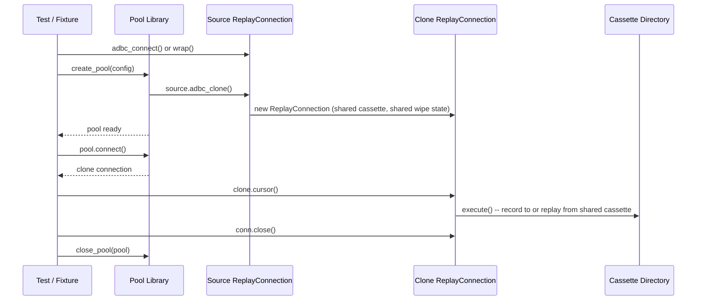

# Connection pooling and replay

This article explains how pytest-adbc-replay handles connection pooling, why clones share cassette paths and wipe state, and what happens when concurrent access is attempted.

## Why clones share the cassette path

A pool connection is logically the same database session. When a pool library calls `adbc_clone()` on a source connection, each checkout is a handle to the same underlying database. All queries from any checkout belong to the same test and should be recorded in the same cassette directory.

If each clone had a separate cassette path, the cassette directory structure would fragment unpredictably based on how many pool connections were checked out. A test that checks out two connections would produce two cassette directories; running the same test with a different pool size would produce a different number. The cassette layout would depend on pool configuration rather than test identity, making replay unreliable.

Sharing the cassette path keeps things simple: one test, one cassette directory, regardless of how many pool connections are used.

## Pool replay lifecycle

The following diagram shows the lifecycle of a pool-based test from source connection through to disposal:

In **record mode**, the real ADBC connection is also cloned via `self._real_conn.adbc_clone()`. Each clone holds its own real connection handle and executes queries against the live database. Results are written to the shared cassette directory.

In **replay mode**, clones have no real connection (`_real_conn = None`). Each cursor loads interactions from the shared cassette directory and replays them without any database access.

## Shared wipe state

In `all` record mode, the cassette directory is wiped before recording begins so that stale interactions are removed. With pooled connections, multiple cursors across multiple clones may call `execute()` -- but only the first one should wipe the directory.

The wipe state is a shared mutable dict (`{"wiped": False}`) referenced by the source connection and all its clones. When the first cursor across any connection calls `execute()`, it checks this dict, wipes the cassette directory via `shutil.rmtree()`, and sets `wiped` to `True`. All subsequent cursors -- on the same connection or on any clone -- see `wiped = True` and skip the wipe.

This prevents a later pool checkout from destroying recordings made by an earlier checkout in the same test.

## Concurrent access and its failure mode

Replay queues are per-cursor, not shared across clones. When a cursor first calls `execute()` in replay mode, it loads all cassette interactions into its own `deque`. Each subsequent `execute()` pops the next interaction from that deque.

If two cursors from different clones execute concurrently -- for example, in multi-threaded test code where two threads each hold a pool connection -- each cursor pops from its own independent queue. The pop order depends on thread scheduling, not query identity. Cursor A might pop a result that was originally recorded for a query that cursor B is about to execute, leading to incorrect result matching.

In typical single-threaded pytest runs, this is never a problem. Cursors execute sequentially: one cursor completes all its queries before another cursor starts. The sequential access model matches how most test code works -- tests call the system under test, which uses one pool connection at a time.

This is a known limitation, not a bug. Supporting truly concurrent replay would require a shared, query-matched replay mechanism rather than simple queue-based replay. The sequential model is enough for typical single-threaded test runs.

## ADBC spec context

`adbc_clone()` is an ADBC extension, not part of the DBAPI 2.0 standard. In the ADBC Python API, calling `connection.adbc_clone()` creates a new `Connection` sharing the same underlying `AdbcDatabase`. The clone has its own transaction state and cursor lifecycle but shares the database handle.

pytest-adbc-replay's `ReplayConnection.adbc_clone()` follows this pattern: the clone shares configuration, cassette path, and wipe state with its source, but maintains independent cursor state.

See the [ADBC Python API documentation](https://arrow.apache.org/adbc/current/python/api/adbc_driver_manager.html) for the upstream specification.

---

- [Use with connection pools](../how-to/connection-pools.md) -- how-to guide with pool fixture patterns
- [Connection Pooling reference](../reference/connection-pooling.md) -- `adbc_clone()` method spec and shared cassette semantics
