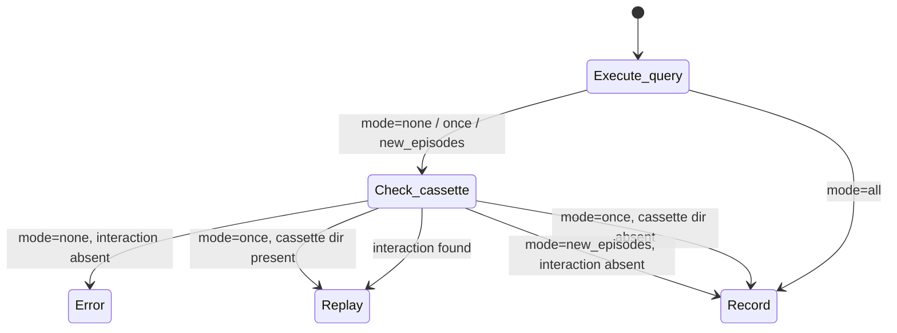

# Record mode semantics

This article explains the four record modes and how they fit different points in a test suite's lifecycle.

## Why four modes

A single record/replay toggle would force a binary choice: either re-record everything or replay everything. This is too blunt.

Test suites evolve. A test might add a new query to an existing flow. A dataset might change and require fresh cassettes. CI should never record, but a developer adding a new test needs to record without disturbing existing cassettes. The four modes address these different situations.

## Mode-by-mode

**`none`** — replay only. The default. The plugin never opens a database connection in this mode. If a cassette directory is missing or the normalised SQL does not match any stored interaction, the test fails immediately with `CassetteMissError`. Use `none` in CI and as the daily development default once cassettes are established.

**`once`** — record if absent, replay if present. Records a cassette the first time a test runs, then never re-records. If the cassette directory already exists, the plugin replays from it. This protects against accidental re-recording: running `pytest --adbc-record=once` twice does not overwrite existing cassettes. Use `once` when adding a new test to a suite where other tests already have cassettes.

**`new_episodes`** — replay existing interactions, record new ones. If an interaction (normalised SQL + parameters) is already in the cassette, the plugin replays it. If the interaction is not found, the plugin records it. Use `new_episodes` when you have added new queries to an existing test and want to record only the new interactions without touching the ones already recorded.

**`all`** — re-record everything. Overwrites all existing cassette files on every run. Always opens a database connection. Use `all` when the live data has changed and all cassettes need refreshing.

## Common workflows

**Initial recording:** The first time a test suite runs, use `--adbc-record=once` to record all cassettes. Commit the cassette directory. Switch back to `none` (the default) for all subsequent runs.

**Adding a query to an existing test:** Use `--adbc-record=new_episodes` to record only the new interaction. The existing recorded interactions in that cassette are replayed, not re-recorded.

**Refreshing stale cassettes:** Use `--adbc-record=all` to re-record everything against the current live data. Review the diffs in the `.sql` files to confirm what changed.

**CI-only replay:** Set `adbc_record_mode = none` in `pyproject.toml`. CI never records; local developers record when needed with `--adbc-record`.

## Decision logic

## What mode controls

The record mode controls two things: whether a database connection is opened at all, and what happens when a cassette interaction is not found.

In `none` mode, the plugin never opens a database connection. No driver import is required, no credentials are checked, and no network call is made. The test either replays from the cassette or raises `CassetteMissError`. This is the only mode where the presence of a database driver does not matter.

In all other modes (`once`, `new_episodes`, `all`), the plugin may open a database connection at some point during the test run. The wrapped connection passed to `adbc_replay.wrap()` is used when a live interaction is needed. If the connection requires credentials, those credentials must be available.

## Mode and the cassette directory

`once` and `none` both look at whether the cassette directory exists. The difference is what they do when it is absent:

- `none`: cassette directory absent → `CassetteMissError`
- `once`: cassette directory absent → record and create the directory

This asymmetry is intentional. In `none` mode, a missing cassette is always an error — it means a test is running without its recorded data. In `once` mode, a missing cassette is expected on the first run and triggers recording.

`new_episodes` and `all` operate at the interaction level rather than the directory level. `new_episodes` checks each individual interaction against the cassette; `all` ignores the cassette entirely and re-records unconditionally.

## Relationship between modes and development stages

The four modes correspond to the lifecycle of a test suite:

| Stage | Mode |
|---|---|
| Writing a new test for the first time | `once` or `all` |
| Extending an existing test with new queries | `new_episodes` |
| Refreshing cassettes after data changes | `all` |
| Normal development and CI | `none` |

The most common path: record with `once` when writing a new test, then never change the mode again. `none` is the default and covers the vast majority of runs.

The mode does not affect the cassette file format or the SQL normalisation process — it only controls whether the plugin reads from an existing cassette, writes a new one, or both.

See [Run in CI without credentials](../how-to/ci-without-credentials.md) for a GitHub Actions job that uses replay mode.

See the [Record Modes reference](../reference/record-modes.md) for the exact behaviour of each mode.
